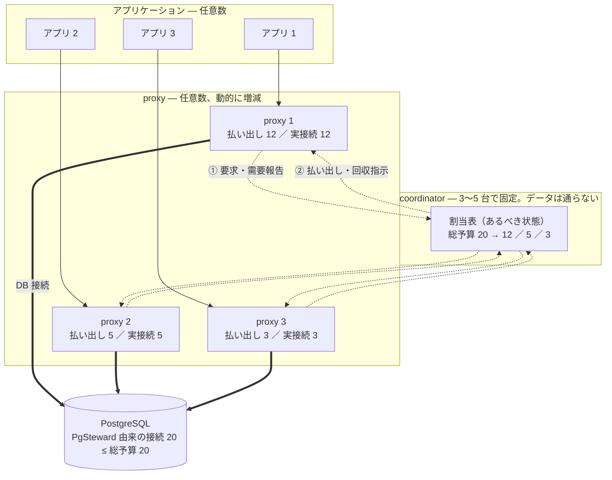

+++
title = "PgSteward: オートスケールする効率的な PostgreSQL コネクションプーラー"
description = "プールサイズを設定ファイルに書く静的な値ではなく、クラスタ全体で配り直される予算として扱うコネクションプーラーを作った。台数もテナント数も増やしても設定を書き換えず、DB 上の接続数が変わらない。"
slug = "pgsteward"
date = 2026-09-13

[taxonomies]
categories = ["記事"]
tags = ["postgresql", "rust", "connection-pooling", "distributed-systems", "raft"]

[extra]
lang = "jp"
toc = true
comment = false
copy = true
math = false
mermaid = true
outdate_alert = false
outdate_alert_days = 120
display_tags = true
truncate_summary = false
featured = false
reaction = false
+++

> 初稿。実測値とリポジトリのリンクは公開時に埋める。ファイル名と `date` も差し替える。

## これまでのコネクションプーラーの課題

アプリケーションが PostgreSQL などのデータベースに接続すると、接続 1 本ごとにコネクションと呼ばれる処理の単位が作られる（PostgreSQL ではプロセス、MySQL ではスレッド）。コネクションを作るコストは安くないし、維持にもメモリがかかるので、アプリケーションはコネクションを毎回作って捨てるのではなく、手元に何本か持って使い回すのが常套手段となっている。多くの言語ではライブラリがコネクションプールを提供していて、事前にデータベースへのコネクションを貼っておき、アプリケーションは必要なときにプールからコネクションを借りて返す。

アプリケーションの数が増えると、ライブラリのコネクションプールだけでは足りなくなる。1 アプリケーションがコネクションを 20 本持っていて、アプリケーションが 50 に増えれば 1,000 本になる。PostgreSQL が受け入れられる本数は `max_connections` というパラメータで決まっていて、上限を超えた接続はエラーになる。

そこでアプリケーションとデータベースの間に置くのがコネクションプーラーである。
PostgreSQL では PgBouncer が有名である。
アプリケーションはライブラリのコネクションプールで複数の接続を保持するが、プーラーは各アプリケーションからの接続をまとめて受け付け、データベースへは少数の接続だけを張って使い回す。
この方式は Proxy 型コネクションプーリングと呼ばれる。
冒頭で説明したクライアント側コネクションプーリングとの違いは[このブログ](https://christina04.hatenablog.com/entry/connection-pooling)を参照してほしい。

Proxy 型コネクションプーリングではアプリケーションから見ると通常どおりデータベースに接続しているようにみえる。
変えるのは接続先の指定だけで、必要な数だけコネクションを貼ることができる。
一方でデータベースから見ると、適切にコネクションを使いまわしているのでアプリケーションが要求する本数よりも格段に少ない接続しか来ない。

PgBouncer のような Proxy 型のコネクションプーラーは PostgreSQL を運用する上で切っても切り離せないものになっている。PgBouncer のほかにもコネクションプーラーが存在している。データベースの運用がより大規模になるにつれてデータベースの機能よりもむしろコネクションプーラーの方に課題が移っている点が重要である。

PostgreSQL で使われている主要なプーラーを並べると、この 10 年の改善がどこに向かっていたかが見える。

| | PgBouncer | PgCat | Supavisor |
|---|---|---|---|
| 主な狙い | 軽量な Proxy 型プーリングの標準 | PgBouncer のマルチコア化とシャーディング | クラウド向けに大量のクライアント接続を捌く |
| 並列性 | ✕ | ○ | ○ |
| プールサイズの決め方 | 設定ファイルに書く静的な値 | 同じ | 同じ |
| サーバー全体の合計上限を書けるか | ✕ [pgbouncer#103](https://github.com/pgbouncer/pgbouncer/issues/103) | ✕ | △ テナントごとに所有ノードを 1 つ決めて集約する |
| 台数を N 倍にしたとき | データベースへの接続も N 倍になる。1 台あたりの値を手動で計算 | 同じ | 増えない |
| テナントを増やしたとき | テナントごとにプールが常駐する [pgbouncer#1085](https://github.com/pgbouncer/pgbouncer/issues/1085) | 同じ [pgcat#806](https://github.com/postgresml/pgcat/issues/806) | 同じ |
| 混雑時の取り分 | 先着順。走査順に依存する [pgbouncer#131](https://github.com/pgbouncer/pgbouncer/issues/131) | 先着順 | 先着順 |
| クエリ経路の追加ホップ | なし | なし | あり |

### 並列性、可用性
PgBouncer は 1 コアしか使えないので 1 プロセスで頭打ちになる。PgCat と Supavisor はマルチコアを使えるので、1 台で捌ける量は上がった。
ただしプーラーを複数台置く理由は性能だけではない。
アプリケーションとデータベースの間に立つ以上、1 台ではそこが単一障害点になるので、冗長化のために最低でも 2〜3 台は並べることになる。

### Fair sharing
PgBouncer では接続先データベースと接続ユーザーの組ごとにプールを分ける。
マルチテナントな SaaS でテナントごとにロールやデータベースを分けていれば、組の数はテナント数になる。
このようなプールの中には普段は使われないが、ある時に急にコネクションを消費する類のものも含まれる。
例えば、夜間に走るバッチジョブやプロモーションによる急なスパイクである。
これらは急激にコネクションを消費して、コネクションプーラーに負荷がかかるだけでなく、他テナントにも影響を与える。
具体的には[特定のユーザーへリソースが偏ったり](https://github.com/pgbouncer/pgbouncer/issues/131)、後続のユーザーにコネクションが配られずに処理がタイムアウトしたりといった問題が発生する。
具体例を出すと、`max_db_connections = 10` をユーザー A / B / C で共有して同じ負荷をかけると A だけが常に接続を取れて C はタイムアウトを繰り返すという挙動が PgBouncer には存在する。

影響の大きさは、待っているクライアントの数には出ない。
バッチのトランザクションは数秒、オンライン API は数ミリ秒なので、同じキューに並べれば接続はバッチ側に滞留する。
待っているクライアントが数えるほどでも、待つ相手が数秒なので API の応答時間は秒オーダーに伸びる。

また負荷のかかった状態だけでなく空きの多い場合にも問題が生じる。もし未使用で空のプールが大量に生じた場合に直接プールを消す手段はなく、解放するには `RECONNECT` で生きている接続まで切ることになる。

### 接続数上限の設定
守りたいのは、データベース 1 台が受け付けられるコネクションの合計である。
PostgreSQL は `max_connections` を超えた接続を拒否するので、合計が上限を超えた瞬間にアプリケーションへエラーが出る。かといってコネクション数に余裕をもって確保してしまうと、1 本あたり 5〜10 MB を消費するコネクションを無駄に抱えることになりリソースの利用効率が悪化する。

PgBouncer が持つ上限は、テナントごとの `pool_size`、データベースごとの `max_db_connections`、ユーザーごとの `max_user_connections` で、そもそもサーバー全体の合計を書く場所がない。
PgBouncer では PostgreSQL ホスト上に複数データベースやユーザーが動的に存在する場合、PostgreSQL の最大接続数を考慮すると各データベース、ユーザーの pool_size を適切に設定することは現状困難である。
したがって、対応づけは人間の割り算になるが、これも現実的ではない。大きく書けばアクセスが集中したときに合計が `max_connections` を超えて接続エラーになり、小さく書けば `max_connections` に余裕があるのに並行度が落ちる。

### プロキシのスケールアウト
合計を書く場所がないこと自体は、台数が固定なら手計算で済む。
プロセスごとの上限に台数を掛けた値が `max_connections` を下回っていることを一度確かめればよく、例えば100 本を 4 台で使うなら 1 台あたり 25 本と書く。
問題はプロキシサーバーの台数が動的に変化する場合である。

プーラーの台数は、プーラー自身の性能とは無関係に動く。
冗長化のために複数台必要になるし、アプリケーションと同じホストに同居させる構成では、アプリケーションが 10 台から 50 台にオートスケールすればプーラーも 50 台になる。
台数あたりのコネクション数が固定のままだと、プロキシサーバーの台数を増やすと簡単に PostgreSQL サーバーの `max_connections` を超えてしまう。
逆に固定値を少なくすると必要以上に少ないコネクション数となり、パフォーマンスを犠牲にすることになる。

## PgSteward: オートスケールする効率的なコネクションプーラー

1 章で見た課題は、どれも「限られたコネクションの取り分をどう決めるか」に畳める。
決め方は 2 つしかない。
テナントごと、プーラーごとに `pool_size` を決め打つか、`max_db_connections` のような合計値だけを決めて要求が来た順に渡すかである。
前者は隣のテナントが何をしても取り分が残るので隔離できるが、使われない取り分がそのまま遊ぶ。
後者は空いたコネクションを誰でも使えるので遊ばないが、1 つのテナントが全部を持っていける。
どちらに倒しても、効率と隔離のどちらかを諦めることになる。

この二者択一を固定しているのは、決め方が静的であることである。
設定ファイルに書いた値は需要の変化に追随しない。
プールサイズは設定ファイルに書く値である、という前提は PgBouncer が 2007 年に登場してから 20 年近く変わっていない。
PgSteward が変えたのはこの 1 点だけで、プールサイズを設定値ではなく、需要に応じて配り直される予算として扱う。

以降では、全体の構成、予算を誰がどう決めるか、それが台数とテナント数にどう効くか、混雑したときに誰が待つか、そしてコネクション数の上限をどう守るかを順に見ていく。
なお、実装はこれからであり、この章で挙げる数値は設計から手計算で導いた期待値である。

### proxy と coordinator
需要に応じて配り直すには、クラスタ全体の割当を 1 箇所で決める主体が要る。
一方で、その主体をクエリの経路に置くと、決めるための通信の遅延がそのままクエリの遅延に乗ってしまう。
決める場所とデータが流れる場所を分ける必要があったので、役割を 2 つにした。
proxy はプーラーの本体で、アプリケーションからのコネクションを受け、データベースへコネクションを張ってクエリを通す。
coordinator は、どの proxy がどのテナントのために何本張ってよいかを決める。
クエリとその応答は proxy とデータベースの間だけを流れ、coordinator を通らない。
役割は分けても運用するものは増やしたくないので、同じバイナリを起動時の指定で振り分ける形にした。

### 全体の構成

上から下がデータの経路で、アプリケーション → proxy → PostgreSQL の 1 本道である。
coordinator は脇にいて、やりとりするのは要求と払い出しだけである。

台数を増やしてもコネクションの総量が変わらないことは、1 章で見たとおり Supavisor が中継によって実現している。
ただしその形は常にホップが乗るので、レイテンシを増やさないことを条件に置くと採れない。
そこで proxy どうしの中継路は持たせず、各 proxy は受け付けたクライアントに対して自ノードが張っているコネクションをそのまま使う形にした。
枠が払い出されている間は、クエリの経路に制御の都合が入らない。
代わりに、どの proxy が何本張ってよいかを別のところで管理する必要が出てくる。

### 割当表と Raft
中継しない以上、コネクションは各 proxy に分散して存在する。
合計が総予算を超えないことを保証するには、誰が何本張ってよいかを 1 箇所にまとめて持つ必要がある。
それが割当表で、どのインスタンスの、どのテナントのために、どの proxy が何本張ってよいかを並べた表である。
この表が失われると配り直しが止まり、払い出し済みの枠の所在も分からなくなるので、1 台のメモリに置いておくわけにはいかない。
1 台落ちても残りが引き継げるようにする必要があったので、表は Raft で複製することにした。
Raft は複数のノードが同じログに同じ順序で合意して複製する仕組みである。
ただし合意のコストは参加ノード数とともに上がるので、合意に参加するのは coordinator の 3〜5 台に固定し、proxy は何台でも動的に増減してよい形にした。

### 総予算の決め方
1 章で見たとおり、守りたいのはサーバー単位の合計であり、それを人間が割り算で作るかぎり台数にもテナント数にも追随できない。
配る総量を 1 つの数として持ち、しかもその数を人間に書かせないことが必要だったので、総予算はデータベース自身から導出することにした。
coordinator がデータベースに接続して `max_connections`、`superuser_reserved_connections`、`reserved_connections` を `SHOW` で読み、他のクライアントが使っているコネクション数を `pg_stat_activity` から数えて、PgSteward が張ってよい本数を求める。
データベースを増強して `max_connections` を 200 から 400 に上げても、PgSteward 側で書き換えるものはない。

### 取り分の決め方
隔離のためには、他のテナントが何をしていても取れる下限が要る。
効率のためには、その下限を超えた分を遊ばせない配り方が要る。
両方を満たす必要があったので、テナントに宣言させるのは最低保証・上限・重みの 3 つだけにした。
Kubernetes の requests と limits に近く、最低保証は他のテナントが何をしていても必ず払い出される本数、上限はそれ以上払い出されない本数である。

最低保証を宣言できるようにすると、今度はその合計が総予算を超える設定を書けてしまう。
1 章で見た「細かい上限の合計が `max_connections` と食い違う」状態をそもそも作れなくする必要があるので、合計が総予算を超える設定は書き込み時に検証して拒否する。

残りをどう配るかが、効率の側の要件である。
総予算から最低保証の合計を引いた残りを余剰とし、配り方には重み付き max-min fair を使うことにした。
少なく要求しているテナントを先に満たし、余った分を多く要求しているテナントで分け合う方式で、重みを付ければ分け合う比率を変えられる。
さらに、テナントを登録しただけで資源を持っていかれないことも要件なので、払い出しは需要のあるところにしか行かない。
テナントを登録しても、proxy を起動しても、クエリが来るまで 1 本も払い出されない。

総予算 100 本、`app_web` の最低保証 30 本、`app_worker` の最低保証 10 本という設定で、`app_web` が 60 本、`app_worker` が 90 本を要求した場合を追う。
最低保証で 30 本と 10 本を先に確保し、残った余剰 60 本を残りの要求（`app_web` 30 本、`app_worker` 80 本）へ公平に配ると各 30 本になる。
`app_web` は 30 + 30 = 60 本で要求を満たし、`app_worker` は 10 + 30 = 40 本になる。
合計は 100 本を超えない。

### プロキシのスケールアウト
台数が動いても総量が変わらないことが目的だったので、払い出しは台数で割るのではなく需要で決める形にした。
効き方を、プーラーを 4 台並べ、ロードバランサの偏りで 1 台目に 60 本ぶんの需要、残り 3 台に 10 本ぶんずつの需要が来た場合で比べる。

| | 既存のプーラーを 4 台 | PgSteward を 4 台 |
|---|---|---|
| 設定する値 | `default_pool_size = 100 ÷ 4 = 25`（プロセスごとの値） | 総予算 100（クラスタ全体の値。実際には書かずに導出される） |
| 1 台目 | 25 本で上限に達し、35 クライアントが待つ | 60 本が払い出される |
| 2〜4 台目 | 各 10 本が稼働し、各 15 本が遊ぶ | 各 10 本 |
| 8 台に増やしたら | 25 本のままだとデータベースへのコネクションが最大 200 本になる。守るには 12 本へ書き換える | 何も変えない。総量は 100 本のまま |
需要駆動なので、台数が総予算を超える構成でも設定が成立する。
200 台に 100 本を配る形は、既存のプーラーでは 1 台あたり 0.5 本と書く必要があって表現できない。

ただし魔法ではない。
台数が総予算を超える構成では、全 proxy が同時に 1 本ずつ持つことは原理的にできない。
需要が全台に散れば枠は要求の強い proxy に集まり、残りの proxy のクライアントは待つ。
枠を頻繁に動かせばコネクションの作り直しが増え、動かさなければ待ちが偏る。
どちらに倒すかは、枠を手放す速さ（ヒステリシス）の調整に落ちる。

### テナント数のスケールアウト
1 章で見た症状は、テナントが現れた時点でプールを作ることから来ていた。
登録しただけのテナントに資源を持たせないためには、プールを作る契機を需要の側へ移す必要がある。
そこで、プールが作られるのは枠が払い出された時点にした。
テナントを 30,000 件登録しても、クエリを投げていないテナントには枠が払い出されず、proxy にプールも作られない。
同時にクエリを投げているテナントが 40 社なら、存在するプールは 40 個である。
需要が消えたテナントのプールは、回収を経て破棄される。
溜まらないので、`RECONNECT` のような一括操作は持たないし、必要もない。

プールが破棄されてもクライアント接続は切れない。
アイドルなクライアントは繋がったままで、次にクエリを投げた時点で需要が立ち、払い出しを受けてコネクションが張られる。
代償はそのときの待ち時間で、払い出しの往復とコネクション確立が 1 度だけ乗る。

### 混雑時の取り分
最低保証と余剰の配り方が実際に効くかは、需要が時刻で入れ替わる構成で見るのが分かりやすい。
オンラインの API を捌く `app_web` と、夜間バッチを走らせる `app_worker` が同じデータベースを使う構成を考える。
用途ごとにロールを分けるのは既存のプーラーでも標準的なやり方で、違うのは分けた両者に固定サイズを与える必要がないことである。
`app_web` の最低保証を 30 本、`app_worker` の最低保証を 10 本とし、上限は両方とも書かない。

日中は `app_worker` が需要を出さないので、枠は 1 本も払い出されない。
余剰はほぼ全部が `app_web` に渡る。
夜間は `app_worker` がバッチを始めて要求を上げる。
未払い出しの余剰は残っていないので、coordinator は `app_web` を捌く proxy に回収を指示し、回収が終わったことを確認してから `app_worker` へ払い出す。
`app_web` の持ち分は減るが、最低保証の 30 本を下回ることはない。
深夜にバッチが走っている最中へ API のトラフィックが来れば、coordinator は逆向きに配り直す。
最低保証の合計 45 本を確保したうえで余剰 55 本を配ると、`app_web` の要求 60 本は全部通り、待つのは `app_worker` だけになる。

固定して分ける方式と比べたときの違いは効率に出る。
同じ 100 本で遊ぶコネクションが減り、3 つの時刻を通した平均稼働率は 65% から 98% になる。

共有する方式と比べたときの違いは、効率ではなく誰が待つかに出る。
稼働率も待っているクライアントの総数もほぼ同じで、PgSteward はコネクションを増やさないので、需要の合計が総予算を超えれば誰かは必ず待つ。
やっているのは待たせる相手を選ぶことで、その選び方を最低保証という形で運用者に宣言させている。
効率を落とさずに、待つ相手をバッチ側に固定できる。
これが隔離と効率を同時に満たすということの実際の意味である。

### 接続上限の守り方
最優先の性質は、データベース上のコネクション数が総予算を超えないことである。
可用性やスループットを犠牲にしてよいから守る、という順序で決めている。
分散システムとして証明するのは難しいので、2 つのローカルな性質に分解した。
1 つは払い出しの合計が総予算を超えないことで、coordinator の状態機械がログエントリを適用する前の条件として検査し、破るエントリはコミットされない。
もう 1 つは proxy の実コネクション数がその proxy への払い出しを超えないことで、proxy の中だけで完結し、他ノードとの通信を含まない。

2 つが同時に成り立てば、実コネクションの合計は総予算を超えない。
どちらも単体なら自明に検査できるので、残るのは 2 つをつなぐ過渡状態だけになる。
当てた規則は 3 つある。

払い出しを減らす途中は、旧保有者が閉じ終わる前に新保有者が張り始めると上限を破るので、回収が完了した報告が Raft にコミットされるまでその分を払い出さない。
proxy がクラッシュしたときは、割当表に払い出しが残っているのに proxy がいないので、払い出しに期限を持たせて失効するまで再払い出ししない。
proxy が coordinator から分断されたときは回収の指示が届かないので、proxy は期限から余裕を引いた時点で、指示を待たずに全コネクションを閉じる（自己フェンス）。
coordinator が失効を認めるのは期限の経過後なので、旧保有者が閉じ終わるほうが必ず先になる。

余裕は、コネクションを全部閉じるのにかかる時間に時計ずれの許容を足した値以上に取る。
あわせて、クラッシュして自己フェンスできない場合の保険として、データベース側の `tcp_keepalives_idle` と `tcp_user_timeout` を払い出しの期限より短く設定することを要求し、起動時に `SHOW` で検証して満たさなければ起動を拒否する。

増やす方向はすべて coordinator の払い出しを起点とし、払い出しは Raft にコミットされてからしか proxy に届かない。
減らす方向だけが proxy の単独判断で起こる。
この非対称が上限を守っている。

証明の外に置いている仮定も書いておく。
単調時計が単調であること、余裕がコネクションを閉じ終わる時間より大きいこと、データベース側のタイムアウトが実際に効くことの 3 つで、どれも破れれば上限が破れる。
仮想化環境で時計が飛べば自己フェンスの判定が遅れるし、閉じる操作が TCP のレベルで詰まれば見積もりを超えうるし、起動時に検証しているのは設定値であって挙動ではない。

## まとめ

1 章で見た課題は、どれもコネクションプーラーの性能ではなく、有限のコネクションをどう配るかに集まっていた。
テナントどうしでは取り分が偏り、余ったコネクションは必要としているところへ回らない。
サーバー単位の合計を書く場所がないので、台数が動けば設定を変えていなくても上限を破る。
そしてこれらは、プールサイズを設定ファイルに書く静的な値として扱っていることから出ている。

配り方を需要に追随させる必要があったので、PgSteward はその 1 点だけを変えた。
プールサイズを設定値ではなく、配り直される予算として扱う。
総予算はデータベースから導出し、テナントには最低保証・上限・重みだけを宣言させ、余剰は需要のあるところへ配る。
そこから、混雑時の取り分、テナント数の増加、プロキシの台数の増加が、別々の対策を足さずに同時に解ける。
逆に言えば、同時に解けるという主張が崩れた時点で、このプロジェクトの価値は薄くなる。
1 つだけなら、既存の実装がすでにある。

まだ決めていないことも残っている。
枠を手放す速さ（ヒステリシス）の既定値は、速すぎればコネクションの作り直しが増え、遅すぎれば待ちが偏るので、実測なしには決められない。
coordinator が全滅したときの挙動も決めていない。
直前のあるべき状態のまま縮退運転を許す形が成立するかは、まだ確かめていない。
proxy の台数が総予算を超える構成は、設定としては書けるものの、望ましい運用の形を確かめていない。

そして何より、実装はこれからである。

TODO: リポジトリとドキュメントへのリンクを入れる。
